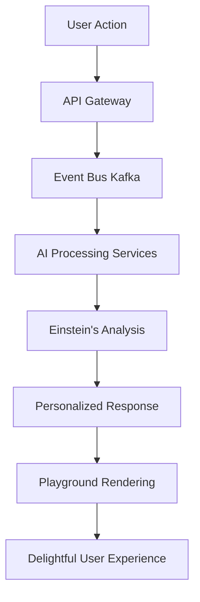

# Ceylon Expand - System Architecture Blueprint v4.0

*"Einstein's Brain Meets a 5-Year-Old's Playground"*

---

## 1. Executive Summary

Ceylon Expand v4.0 embodies a revolutionary design philosophy: **Einstein's Brain powering a 5-Year-Old's Playground**. This architecture creates the perfect symbiosis between sophisticated backend intelligence and delightfully simple frontend experiences.

### The Einstein's Brain Backend
Our backend operates like Einstein's mind - processing complex patterns, making intelligent predictions, and solving sophisticated problems invisibly. It features:
- Advanced AI/ML for personalized recommendations
- Predictive analytics for user behavior and safety
- Intelligent content moderation and anomaly detection
- Real-time data processing and event-driven architecture
- Automated optimization and self-healing systems

### The 5-Year-Old's Playground Frontend
Our frontend is designed with the simplicity and joy of a child's playground - intuitive, colorful, and delightful. Every interaction feels like play:
- One-tap actions for complex operations
- Playful animations and gamified interactions
- Visual storytelling instead of text-heavy interfaces
- Progressive disclosure to prevent overwhelm
- Accessibility-first design for all ages and abilities

### The Magic Combination
This contrast creates a platform that's simultaneously the smartest travel platform in Sri Lanka and the easiest to use. Users experience effortless interactions while benefiting from sophisticated AI-driven features they never see working behind the scenes.

---

## 2. Technology Stack

### Backend: Einstein's Brain Infrastructure

```typescript
// Core Backend Stack
const einsteinBrain = {
  runtime: "Node.js 20+ with TypeScript",
  database: {
    primary: "PostgreSQL 16 with pgvector for AI",
    cache: "Redis Cluster for real-time data",
    search: "Elasticsearch for intelligent search",
    analytics: "ClickHouse for behavioral insights"
  },
  ai_ml: {
    framework: "TensorFlow.js + Python microservices",
    models: "GPT-4 for content, Claude for moderation",
    vectorDB: "Pinecone for semantic search",
    recommendations: "Custom ML pipeline with real-time learning"
  },
  architecture: {
    pattern: "Event-driven microservices",
    messaging: "Apache Kafka for event streaming",
    api: "GraphQL Federation + REST",
    deployment: "Kubernetes on GCP",
    monitoring: "Datadog with AI anomaly detection"
  }
}
```

### Frontend: Playground Experience

```typescript
// Playground Frontend Stack
const playgroundExperience = {
  framework: "React 18 with Next.js 14",
  styling: {
    design: "Tailwind CSS with custom playground theme",
    animations: "Framer Motion for delightful interactions",
    icons: "Custom illustrated icon set (child-friendly)",
    accessibility: "Reach UI + ARIA patterns"
  },
  features: {
    pwa: "Service Workers for offline playground",
    performance: "React Server Components + Edge caching",
    i18n: "Next-intl for international tourist languages",
    state: "Zustand for simple state management"
  },
  mobile: {
    approach: "Mobile-first responsive design",
    gestures: "Touch-optimized with haptic feedback",
    performance: "Sub-1s load times on 3G"
  }
}
```

---

## 3. Core Platform Features

### 3.1 Intelligent Trip Discovery
**Einstein's Brain**: AI analyzes user preferences, travel history, social connections, weather patterns, and local events to curate perfect trip matches.

**Playground Experience**: 
- Big, colorful trip cards with emoji representations
- "Magic Wand" button that finds trips instantly
- Swipe gestures like a card game
- Animated route previews on a playful map

### 3.2 AI-Powered Community Hub
**Einstein's Brain**: Natural language processing for auto-categorization, sentiment analysis for toxic content detection, and intelligent answer matching.

**Playground Experience**:
- Question wizard with illustrated step-by-step guidance
- Badge system for helpful contributors
- Animated reactions (hearts, stars, thumbs up)
- Voice-to-text for easy question posting

### 3.3 Smart Chat & Coordination
**Einstein's Brain**: ML-powered translation, smart scheduling suggestions, and predictive messaging for common trip coordination needs.

**Playground Experience**:
- Chat bubbles with travel-themed stickers
- One-tap templates: "I'm running late", "Found parking", "Let's meet here"
- Visual itinerary sharing with timeline graphics
- Group polls with fun voting animations

### 3.4 AI Copilots for Users

```typescript
interface AICopilot {
  tripPlanner: {
    prompt: "Tell me what you want to do",
    response: "3 perfect trip suggestions with reasons why",
    interaction: "Conversational with follow-up questions"
  },
  
  postingAssistant: {
    prompt: "I want to go to Kandy tomorrow",
    response: "Smart form pre-filled with suggestions",
    features: ["Price recommendations", "Safety tips", "Best routes"]
  },
  
  buddyMatcher: {
    intelligence: "Analyze compatibility beyond just destination",
    presentation: "Show matches with compatibility scores and reasons",
    interaction: "Swipe-based matching with explanations"
  }
}
```

### 3.5 Gamification Hooks

```typescript
const gamificationSystem = {
  badges: [
    "First Trip 🚗", "Super Host 🌟", "Community Helper 💡",
    "Safety Champion 🛡️", "Local Expert 🏝️", "Eco Warrior 🌱"
  ],
  
  animations: {
    levelUp: "Confetti celebration when earning badges",
    streaks: "Fire emoji animations for consecutive activities",
    achievements: "Unlock animations with sound effects"
  },
  
  progressBars: {
    profileCompletion: "Visual progress with encouraging messages",
    tripMilestones: "Journey maps showing travel achievements",
    communityRep: "Thermometer-style reputation building"
  }
}
```

---

## 4. Admin System: Mission Control

### 4.1 Einstein's Brain Analytics Dashboard

```typescript
interface AdminIntelligence {
  predictiveModeration: {
    riskScoring: "ML models predict problematic users/content",
    autoActions: "Automatic warnings and restrictions",
    humanEscalation: "Flag complex cases for human review"
  },
  
  businessIntelligence: {
    userBehaviorPrediction: "Churn risk, engagement patterns",
    demandForecasting: "Popular routes and peak times",
    safetyAnalytics: "Route safety scores and incident prediction"
  },
  
  anomalyDetection: {
    fraudPrevention: "Detect fake accounts and spam",
    systemHealth: "Auto-healing infrastructure monitoring",
    usagePatterns: "Identify unusual platform behavior"
  }
}
```

### 4.2 Playground Admin Console (Mobile-First)

```typescript
const adminPlayground = {
  threeTabDesign: {
    overview: "🎯 Today's Key Metrics (big numbers, simple charts)",
    actions: "⚡ Quick Actions (3-tap solutions for common issues)",
    insights: "🧠 AI Insights (what Einstein's Brain discovered today)"
  },
  
  criticalActions: {
    userSafety: "One tap to restrict dangerous users",
    contentModeration: "Swipe to approve/reject reported content",
    systemAlerts: "Push notifications for urgent issues"
  },
  
  mobileOptimization: {
    touchTargets: "Minimum 44px touch targets",
    offline: "Core functions work without internet",
    gestures: "Swipe, pinch, and tap optimized workflows"
  }
}
```

---

## 5. Data Flow & APIs

### 5.1 Einstein's Brain Processing Pipeline



### 5.2 GraphQL Federation Architecture

```typescript
// Main Gateway Schema
const einsteinAPI = {
  userService: {
    queries: ["getPersonalizedRecommendations", "getUserInsights"],
    mutations: ["updatePreferences", "trackBehavior"],
    subscriptions: ["realTimeNotifications", "liveUpdates"]
  },
  
  tripService: {
    queries: ["getIntelligentMatches", "getPredictiveRouting"],
    mutations: ["createSmartTrip", "optimizeItinerary"],
    subscriptions: ["tripUpdates", "matchingAlerts"]
  },
  
  communityService: {
    queries: ["getContextualQuestions", "getPersonalizedAnswers"],
    mutations: ["postWithAIAssistance", "moderateContent"],
    subscriptions: ["communityActivity", "reputationChanges"]
  }
}
```

### 5.3 Event-Driven Intelligence

```typescript
interface EinsteinEvents {
  userBehavior: {
    tripViewed: "Update recommendation models",
    profileUpdated: "Recalculate compatibility scores",
    messagesSent: "Analyze communication patterns"
  },
  
  systemOptimization: {
    performanceMetrics: "Auto-scale based on usage patterns",
    errorPatterns: "Predictive error prevention",
    userFeedback: "Continuous UI/UX optimization"
  }
}
```

---

## 6. Security & Compliance

### 6.1 Einstein's Brain Security Intelligence

```typescript
const securityBrain = {
  aiIntrusionDetection: {
    models: "Behavioral analysis for anomaly detection",
    realTime: "Live threat assessment and response",
    learning: "Adaptive security that improves over time"
  },
  
  predictiveAbusePrevention: {
    userRiskScoring: "ML models identify potential bad actors",
    contentAnalysis: "Real-time toxicity and spam detection",
    networkAnalysis: "Graph analysis for coordinated attacks"
  },
  
  privacyIntelligence: {
    dataMinimization: "AI determines minimal data needs",
    consentOptimization: "Smart consent based on actual usage",
    anonymization: "Intelligent data anonymization for analytics"
  }
}
```

### 6.2 Playground Privacy Design

```typescript
const playgroundPrivacy = {
  childFriendlyControls: {
    toggles: "Big, visual on/off switches with icons",
    explanations: "Simple language: 'Share your trips with friends?'",
    visualization: "Show data usage with friendly graphics"
  },
  
  oneTabConsent: {
    design: "Single screen with clear choices",
    language: "5th-grade reading level explanations",
    defaults: "Privacy-first default settings"
  },
  
  parentalFeatures: {
    underageProtection: "Enhanced privacy for users under 18",
    parentalDashboard: "Simple controls for parents",
    safetyFirst: "Location sharing with safety restrictions"
  }
}
```

---

## 7. UX & UI Architecture

### 7.1 Playground Navigation Philosophy

```typescript
const playgroundNavigation = {
  bigButtonDesign: {
    minSize: "60px touch targets for all actions",
    colors: "High contrast, colorful but not overwhelming",
    spacing: "Generous whitespace to prevent mis-taps"
  },
  
  progressiveDisclosure: {
    principle: "Show 3 options maximum at any time",
    implementation: "Wizard-style flows for complex actions",
    visual: "Breadcrumbs with fun illustrations"
  },
  
  gestureOptimization: {
    swipe: "Card-based interfaces for browsing",
    pinch: "Zoom maps and images naturally",
    longPress: "Context menus with haptic feedback"
  }
}
```

### 7.2 Gamified Interaction Patterns

```typescript
const gamifiedElements = {
  microInteractions: {
    buttonPress: "Slight bounce animation with sound",
    cardFlip: "Smooth 3D flip transitions",
    loading: "Playful spinner animations instead of boring bars"
  },
  
  rewardFeedback: {
    completion: "Confetti animation for completed actions",
    progress: "Filling animations with encouraging messages",
    achievements: "Modal celebrations with badge presentations"
  },
  
  visualStorytelling: {
    onboarding: "Comic-strip style introduction",
    features: "Illustrated tutorials with character guides",
    errors: "Friendly monster characters explain problems"
  }
}
```

### 7.3 Accessibility Excellence

```typescript
const accessibilityFeatures = {
  wcag22Compliance: {
    colorContrast: "AAA compliance with alternative indicators",
    keyboardNav: "Full keyboard navigation with visible focus",
    screenReader: "Semantic HTML with comprehensive ARIA labels"
  },
  
  inclusiveDesign: {
    textToSpeech: "Built-in voice reading for all text",
    visualImpairment: "High contrast mode and large text options",
    motorImpairment: "Large touch targets and dwell-click options"
  },
  
  languageAccessibility: {
    multilingual: "International tourist languages with region detection",
    translation: "AI-powered real-time translation in chat for international visitors"
  }
}
```

---

## 8. Performance & Scalability

### 8.1 Einstein's Brain Infrastructure

```typescript
const backendPerformance = {
  autoScaling: {
    kubernetes: "Horizontal pod autoscaling based on custom metrics",
    predictive: "ML-based scaling before traffic spikes",
    costOptimization: "Right-sizing with usage pattern analysis"
  },
  
  eventStreaming: {
    kafka: "High-throughput event processing",
    redis: "Sub-millisecond caching layer",
    graphQL: "Efficient data fetching with batching"
  },
  
  aiOptimization: {
    queryOptimization: "AI analyzes and optimizes database queries",
    cacheIntelligence: "Smart caching based on usage patterns",
    loadBalancing: "AI-driven traffic distribution"
  }
}
```

### 8.2 Playground Performance

```typescript
const frontendPerformance = {
  instantLoad: {
    target: "Sub-1 second initial page load",
    techniques: "Server components + edge caching",
    measurement: "Real user monitoring in key locations"
  },
  
  offlinePlayground: {
    serviceWorker: "Comprehensive offline functionality",
    storage: "IndexedDB for offline data",
    sync: "Background sync when connection returns"
  },
  
  adaptiveDelivery: {
    connection: "Adapt UI complexity based on connection speed",
    device: "Responsive performance based on device capabilities",
    battery: "Reduce animations when battery is low"
  }
}
```

---

## 9. Future-Ready Architecture

### 9.1 AI Agent Ecosystem

```typescript
interface FutureAIAgents {
  personalTravelAgent: {
    capability: "End-to-end trip planning and booking",
    integration: "Third-party booking APIs and payment systems",
    personality: "Learns user preferences and communication style"
  },
  
  safetyGuardian: {
    capability: "Real-time safety monitoring and alerts",
    integration: "Government databases, weather APIs, traffic systems",
    proactive: "Predictive safety recommendations"
  },
  
  culturalGuide: {
    capability: "Local customs, language help, cultural tips",
    integration: "Cultural databases, local expert network",
    adaptive: "Personalized cultural sensitivity guidance"
  }
}
```

### 9.2 Modular Integration Platform

```typescript
const modularBackend = {
  pluginArchitecture: {
    payment: "Stripe, PayPal, local payment gateways",
    booking: "Hotels.com, Booking.com, local accommodations",
    transport: "Uber, PickMe, train/bus booking systems"
  },
  
  apiStandardization: {
    openAPI: "Comprehensive API documentation",
    webhooks: "Event-driven integration patterns",
    graphQL: "Unified data layer for all integrations"
  }
}
```

### 9.3 Playground Personalization Engine

```typescript
const personalizationEngine = {
  themingSystem: {
    userPreferences: "Color schemes, animation levels, information density",
    accessibility: "Automatic adaptations based on user needs",
    cultural: "Region-specific UI patterns and content"
  },
  
  behaviorAdaptation: {
    learningInterface: "UI adapts to user behavior patterns",
    shortcutCreation: "Smart shortcuts based on frequent actions",
    contentPrioritization: "Surface most relevant content first"
  },
  
  contextualInterface: {
    timeOfDay: "Interface adapts to morning/afternoon/evening usage",
    location: "Show relevant features based on current location",
    travelMode: "Different UI when actively traveling vs. planning"
  }
}
```

---

## 10. Implementation Roadmap

### Phase 1: Foundation (Months 1-3)
- **Einstein's Brain Core**: Microservices architecture, AI/ML pipeline
- **Playground Basics**: New design system, core component library
- **Infrastructure**: Kubernetes deployment, monitoring setup

### Phase 2: Intelligence Layer (Months 4-6)
- **AI Features**: Recommendation engine, predictive analytics
- **Gamification**: Badge system, animations, user progression
- **Advanced UI**: Accessibility features, multi-language support

### Phase 3: Ecosystem (Months 7-9)
- **AI Agents**: Travel assistant, safety guardian
- **Integration Platform**: Payment systems, booking partnerships
- **Admin Intelligence**: Predictive moderation, business analytics

### Phase 4: Innovation (Months 10-12)
- **Advanced Personalization**: Adaptive UI, cultural customization
- **Next-Gen Features**: Voice interface, AR route preview
- **Platform Evolution**: Open API ecosystem, developer platform

---

## Conclusion

Ceylon Expand v4.0 represents the perfect marriage of sophisticated intelligence and delightful simplicity. By building Einstein's Brain as our backend and a 5-Year-Old's Playground as our frontend, we create a platform that's simultaneously the most advanced travel platform in Sri Lanka and the easiest to use.

This architecture ensures that every user, regardless of technical skill or age, can effortlessly plan, share, and enjoy travel experiences while benefiting from cutting-edge AI that works invisibly in the background. The result is a platform that feels magical in its simplicity while being powered by genuine intelligence.

*"The best technology is invisible. The best user experience feels like play."*

---

**Document Version**: 4.0  
**Last Updated**: September 2025  
**Next Review**: December 2025